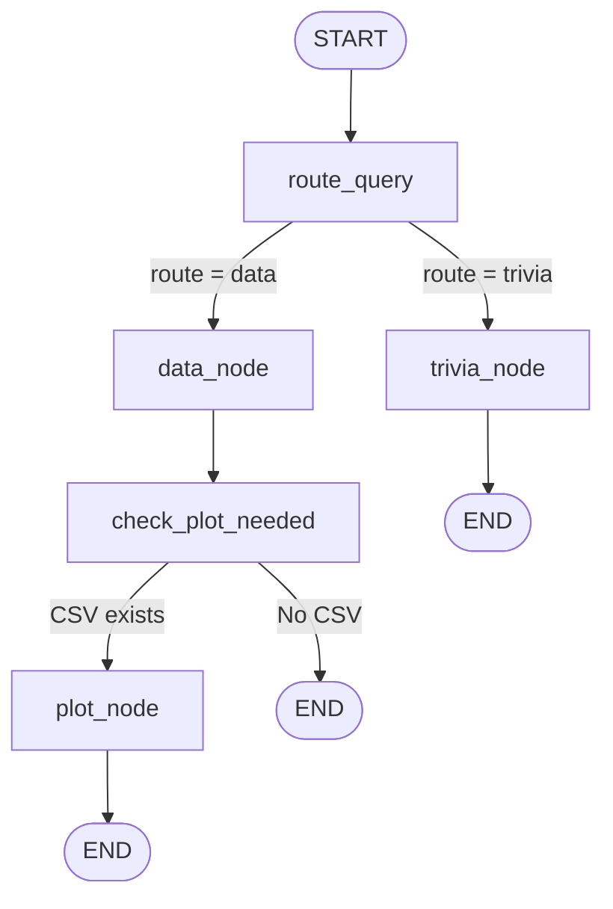

# 🏏 Stumped AI — IPL Analytics GenAI Agent

[](https://stumped-ai.onrender.com/)


---

## Overview

**Stumped AI** is a multi-agent, LangGraph-powered conversational assistant that answers complex questions about the Indian Premier League (IPL). Rather than relying on hallucinated LLM knowledge, the system operates on a **Tool-Augmented Generation** architecture — it writes and executes real SQL against a Google Cloud BigQuery warehouse, generates interactive Plotly visualizations from the actual query results, and falls back to web search for trivia that lives outside the database.

### Why This Exists

Traditional chatbots either hallucinate statistics or require rigid, pre-built dashboards. Stumped AI bridges the gap: users ask questions in plain English, and a deterministic graph of specialised agents collaborates to fetch, analyze, and visualize the answer — with full transparency into every SQL query and Python snippet executed.

---

## Table of Contents

- [Architecture Overview](#architecture-overview)
- [Agent Deep Dive](#agent-deep-dive)
  - [Router (Intent Classification)](#1-router-intent-classification)
  - [Data Agent (BigQuery SQL Expert)](#2-data-agent-bigquery-sql-expert)
  - [Plot Agent (Visualization Scientist)](#3-plot-agent-visualization-scientist)
  - [Trivia Agent (Web Search)](#4-trivia-agent-web-search)
- [Tool Definitions](#tool-definitions)
- [LangGraph Workflow (State Machine)](#langgraph-workflow-state-machine)
- [Data Pipeline](#data-pipeline)
- [Streamlit Frontend](#streamlit-frontend)
- [Tech Stack](#tech-stack)
- [Project Structure](#project-structure)
- [Setup & Installation](#setup--installation)
- [Deployment (Render)](#deployment-render)

---

## Architecture Overview

```
┌──────────────────────────────────────────────────────────────────┐
│                        STREAMLIT FRONTEND                        │
│  (app.py — Chat UI, SQL/Code expanders, DataFrame, Plotly HTML)  │
└──────────────────────────┬───────────────────────────────────────┘
                           │ run_agent(prompt, history)
                           ▼
┌──────────────────────────────────────────────────────────────────┐
│                    LANGGRAPH STATE MACHINE                        │
│                     (ipl_agent/agent.py)                          │
│                                                                  │
│   START ──▶ route_query ──┬──▶ data_node ──▶ check_plot_needed   │
│                           │                   │            │     │
│                           │              plot_node        END    │
│                           │                   │                  │
│                           │                  END                 │
│                           │                                      │
│                           └──▶ trivia_node ──▶ END               │
└──────────────────────────────────────────────────────────────────┘
                           │
              ┌────────────┼────────────┐
              ▼            ▼            ▼
        ┌──────────┐ ┌──────────┐ ┌──────────┐
        │ BigQuery │ │  Plotly   │ │  Google  │
        │  (GCP)   │ │ (Local)  │ │  Search  │
        └──────────┘ └──────────┘ └──────────┘
```

The system is composed of **three specialised sub-agents** orchestrated by a **deterministic LangGraph state machine**. Each agent is a ReAct loop (Reason → Act → Observe) built with `create_react_agent`, constrained to its own tool subset.

---

## Agent Deep Dive

### 1. Router (Intent Classification)

**File**: `ipl_agent/agent.py` — `route_query()` function

The Router is not a full agent — it is a deterministic node in the graph that classifies every incoming user message into one of two intents: **`DATA`** or **`TRIVIA`**.

#### How It Works

```
User Message
     │
     ▼
┌────────────────────────┐
│  Keyword Scan (Fast)   │  ← Checks for "runs", "wickets", "plot", "chart", etc.
│  ~30 data keywords     │
└────────┬───────────────┘
         │ Match found? → Route: DATA
         │ No match?
         ▼
┌────────────────────────┐
│  LLM Fallback (Slow)  │  ← Sends a classification prompt to the LLM
│  "Output DATA or       │
│   TRIVIA strictly"     │
└────────┬───────────────┘
         │ Response contains "DATA"? → Route: DATA
         │ Otherwise → Route: TRIVIA
         │ Exception? → Fallback: DATA
         ▼
      Route Set
```

**Design Rationale**: The two-tier approach (keywords first, LLM fallback) minimises latency for the ~80% of queries that contain obvious statistical keywords, while still handling ambiguous edge cases via the LLM.

---

### 2. Data Agent (BigQuery SQL Expert)

**File**: `ipl_agent/agent.py` — `data_agent` (ReAct agent)  
**LLM**: `google/diffusiongemma-26b-a4b-it` via NVIDIA NIM  
**Tools**: `get_schema_info`, `execute_bq_query`, `resolve_player_name`

The Data Agent is the core analytical engine. It receives a natural language question and autonomously:

1. **Inspects table schemas** — calls `get_schema_info` to learn column names, types, and descriptions before writing any SQL.
2. **Resolves player names** — calls `resolve_player_name` to convert full names (e.g. "Virat Kohli") to the abbreviated database format (e.g. "V Kohli").
3. **Writes & executes SQL** — generates BigQuery-compliant SQL and runs it via `execute_bq_query`.
4. **Summarises results** — provides a concise text summary of the findings (raw data is rendered separately by the UI).

#### Execution Flow

```
User: "Top 5 run scorers in IPL 2024"
     │
     ▼
┌─────────────────────────────┐
│  1. get_schema_info          │  ← Fetches schema for batting_scorecard, matches
│     ["batting_scorecard",    │
│      "matches"]              │
└──────────────┬──────────────┘
               ▼
┌─────────────────────────────┐
│  2. execute_bq_query         │  ← Writes and runs SQL with JOIN on match_id
│     SELECT batter,           │     to filter by season = '2024'
│     SUM(runs) ...            │
│     ORDER BY ... LIMIT 5     │
└──────────────┬──────────────┘
               │ Returns: CSV path + data preview
               ▼
┌─────────────────────────────┐
│  3. Text Summary             │  ← "The top 5 run scorers in 2024 were..."
└─────────────────────────────┘
```

#### Critical Rules Enforced via System Prompt

| Rule | Purpose |
|------|---------|
| Always call `get_schema_info` first | Prevents hallucinated column names |
| Call `resolve_player_name` for player queries | Handles abbreviated name format in DB |
| JOIN with `matches` for temporal queries | Scorecard tables lack a `season` column |
| Use `(SUM(runs)/SUM(balls))*100` for strike rate | Prevents incorrect `AVG(strike_rate)` |
| Filter by `batting_team` for team stats | Prevents pulling opponent batters |
| One tool call per LLM turn | NVIDIA NIM limitation workaround |
| Never generate plot code | Separation of concerns — plotting is the Plot Agent's job |
| Auto-append `LIMIT 1000` | Safety guardrail for runaway queries |

---

### 3. Plot Agent (Visualization Scientist)

**File**: `ipl_agent/agent.py` — `plot_agent` (ReAct agent)  
**LLM**: `google/diffusiongemma-26b-a4b-it` via NVIDIA NIM  
**Tools**: `execute_plot_code`

The Plot Agent is invoked **after** the Data Agent whenever a CSV file was generated. It receives:
- The **CSV file path** from the Data Agent's query results
- The **SQL query** that generated the data (for schema context)
- The **original user question** (to determine chart type and title)

#### Execution Flow

```
Data Agent Output (CSV + SQL + Answer)
     │
     ▼
┌──────────────────────────────────┐
│  Context Trimming                │  ← Only user query + CSV path + SQL context
│  (Strips full message history    │     are passed to avoid context pollution
│   to prevent confusion)         │
└──────────────┬───────────────────┘
               ▼
┌──────────────────────────────────┐
│  LLM writes Python code:        │
│  - pd.read_csv(r'<csv_path>')   │  ← Reads actual data, no hallucination
│  - plotly.express / graph_objects│
│  - fig.write_html(__OUTPUT_PATH__)│  ← Pre-injected variable
│  - template='plotly_dark'        │
└──────────────┬───────────────────┘
               ▼
┌──────────────────────────────────┐
│  execute_plot_code tool          │  ← exec() in sandboxed globals
│  - Captures stdout               │
│  - Saves HTML to plots/ dir      │
│  - Returns SUCCESS + file path   │
└──────────────────────────────────┘
```

#### Anti-Hallucination Design

The Plot Agent **never hardcodes data values**. It is instructed to always load from the CSV file generated by the Data Agent. This ensures the visualized data is identical to the queried data — no LLM fabrication of numbers.

#### Why Context Trimming?

The full LangGraph message history contains tool calls, schema dumps, and SQL results from the Data Agent. Passing all of this to the Plot Agent would confuse it and waste context window. Instead, only a surgically crafted prompt with the CSV path, SQL context, and user question is forwarded.

---

### 4. Trivia Agent (Web Search)

**File**: `ipl_agent/agent.py` — `trivia_agent` (ReAct agent)  
**LLM**: `qwen/qwen3.5-122b-a10b` via NVIDIA NIM  
**Tools**: `search_cricinfo`, `web_search`

The Trivia Agent handles questions that **don't require database queries** — player profiles, cricket rules, news, general knowledge, or ESPNcricinfo lookups.

#### Execution Flow

```
User: "Tell me about Virat Kohli's career"
     │
     ▼
┌─────────────────────────────┐
│  search_cricinfo             │  ← Generates Google search URL:
│  query="Virat Kohli"         │     google.com/search?q=Virat+Kohli+cricinfo
│  search_type="player"        │
└──────────────┬──────────────┘
               ▼
┌─────────────────────────────┐
│  Friendly response with     │  ← "Here's the Cricinfo profile link for
│  search link included       │     Virat Kohli: [link]"
└─────────────────────────────┘
```

**Why a separate LLM?** The Trivia Agent uses `qwen/qwen3.5-122b-a10b` instead of the Gemma model used by the other agents. This is because the trivia tasks benefit from a model with broader general knowledge and conversational ability, while the data/plot agents need a model that excels at structured output (SQL, Python).

---

## Tool Definitions

Each tool is a `@tool`-decorated LangChain function with a Pydantic schema for argument validation.

| Tool | Agent | Description |
|------|-------|-------------|
| `get_schema_info` | Data | Fetches BigQuery table schemas (columns, types, descriptions). Results are cached in `_SCHEMA_CACHE` to avoid repeat API calls. |
| `execute_bq_query` | Data | Runs a SQL query on BigQuery, saves results as a CSV to `query_results/`, and returns a data preview (first 50 rows as JSON). |
| `resolve_player_name` | Data | Converts full player names to the abbreviated format used in the database. Uses exact match → surname match → initial narrowing → fuzzy substring fallback. Player names are cached in `_PLAYER_NAME_CACHE`. |
| `execute_plot_code` | Plot | Executes arbitrary Python code via `exec()` in an isolated namespace. Injects `__OUTPUT_PATH__` for the chart output location. Captures stdout as a fallback if no file is written. |
| `search_cricinfo` | Trivia | Constructs a Google search URL targeting ESPNcricinfo results. |
| `web_search` | Trivia | Placeholder for general web search queries. |

---

## LangGraph Workflow (State Machine)

The orchestration layer is a **compiled LangGraph `StateGraph`** with deterministic routing (no LLM-driven edge decisions after the initial classification).

### State Schema

```python
class GraphState(TypedDict):
    messages: Annotated[list, add_messages]  # Full message history
    route: str                                # "data" | "trivia" | "plot" | "end"
    final_answer: str                         # Text response for the UI
    plot_path: str                            # Path to generated HTML chart
    query_data: str                           # Path to CSV from BigQuery
    sql_queries: list                         # All SQL queries executed
    plot_code: str                            # Python code used for plotting
```

### Graph Topology



### Node-by-Node Walkthrough

| Node | Function | Input | Output | Description |
|------|----------|-------|--------|-------------|
| `route_query` | `route_query()` | User message | `route: "data" \| "trivia"` | Classifies intent using keywords + LLM fallback |
| `data_node` | `data_node()` | Full messages | `final_answer`, `sql_queries`, `query_data` (CSV path) | Invokes the Data Agent ReAct loop. Extracts SQL queries and CSV path from intermediate tool call messages. |
| `trivia_node` | `trivia_node()` | Full messages | `final_answer` | Invokes the Trivia Agent ReAct loop. |
| `check_plot_needed` | `check_plot_needed()` | `query_data` | `route: "plot" \| "end"` | Checks if a CSV file was generated. If yes → plot. Always auto-plots when data exists. |
| `plot_node` | `plot_node()` | `query_data`, `sql_queries`, user message | `plot_path`, `plot_code` | Constructs a trimmed context for the Plot Agent, invokes it, and extracts the generated HTML path. |

### Edge Definitions

```python
START ──────────────────▶ route_query
route_query ──(conditional)──▶ data_node | trivia_node
data_node ──────────────▶ check_plot_needed
check_plot_needed ──(conditional)──▶ plot_node | END
plot_node ──────────────▶ END
trivia_node ────────────▶ END
```

---

## Data Pipeline

**File**: `data_pipeline/parse_ipl.py`

The data pipeline is a standalone ETL script that downloads, parses, and uploads IPL match data to BigQuery.

### Pipeline Flow

```
1. DOWNLOAD     ── Fetches ipl_male_json.zip from cricsheet.org
        │
        ▼
2. EXTRACT      ── Unzips ~1100+ JSON files (one per match)
        │
        ▼
3. PARSE        ── Iterates every JSON file and extracts:
        │           • Match metadata (teams, venue, toss, result)
        │           • Player of the Match awards
        │           • Player registries (name → Cricsheet ID)
        │           • Ball-by-ball deliveries (runs, extras, wickets)
        │           • DRS reviews
        │           • Impact player replacements
        │
        ▼
4. AGGREGATE    ── Computes derived tables from raw deliveries:
        │           • Overs summary (runs/wickets per over, cumulative)
        │           • Batting scorecards (runs, balls, 4s, 6s, SR, dismissal)
        │           • Bowling scorecards (overs, maidens, wickets, economy)
        │           • Partnerships (per-wicket, individual contributions)
        │
        ▼
5. UPLOAD       ── Pushes all 12 tables to BigQuery via pandas_gbq
        │           • Mode: REPLACE (full refresh)
        │           • Applies column descriptions to BQ schema
        │
        ▼
6. LOG          ── Uploads processing_log table for auditability
```

### BigQuery Tables

| Table | Rows (approx.) | Description |
|-------|-----------------|-------------|
| `matches` | ~1,100 | Match-level metadata: teams, venue, result, toss |
| `mom` | ~1,100 | Player of the Match awards |
| `players` | ~25,000 | Player-team-match mapping with Cricsheet registry IDs |
| `totals` | ~2,500 | Innings-level totals (runs, wickets, overs, extras breakdown) |
| `deliveries` | ~250,000 | Ball-by-ball data with powerplay flags, boundaries, extras |
| `wickets` | ~14,000 | Dismissal details: kind, fielders, team score at fall |
| `reviews` | ~1,500 | DRS review outcomes |
| `replacements` | ~500 | Impact player / concussion substitutions |
| `overs` | ~35,000 | Per-over aggregations with cumulative team score |
| `batting_scorecard` | ~28,000 | Per-batter per-match stats with dismissal info |
| `bowling_scorecard` | ~18,000 | Per-bowler per-match stats with maiden/economy calculations |
| `partnerships` | ~20,000 | Wicket partnerships with individual batter contributions |

---

## Streamlit Frontend

**File**: `app.py`

The Streamlit app provides a chat interface with full transparency into the agent's reasoning.

### UI Features

| Feature | Implementation |
|---------|---------------|
| **Chat History** | Stored in `st.session_state.messages` — persists across reruns |
| **Agent Memory** | `st.session_state.agent_history` — last 10 messages passed to LangGraph for multi-turn context |
| **Status Indicator** | `st.status()` widget shows "Agent Workflow Initiated..." → "Analysis Complete!" |
| **Typewriter Effect** | `st.write_stream()` streams the final answer word-by-word |
| **SQL Expander** | Every SQL query executed is shown in a collapsible `st.expander` with syntax highlighting |
| **Plot Code Expander** | The Python visualization code is shown in a collapsible expander |
| **Raw Data Table** | The CSV query results are rendered as an interactive `st.dataframe` — this prevents LLM hallucination by showing the actual data |
| **Interactive Charts** | Plotly HTML charts are embedded inline via `components.html()` |
| **Auto Cleanup** | On startup, deletes files older than 2 days from `query_results/` and `plots/` |

### Data Flow

```
User types query
     │
     ▼
app.py calls run_agent(prompt, history)
     │
     ▼
LangGraph executes full workflow
     │
     ▼
Returns: { answer, plot_path, sql_queries, plot_code, csv_path }
     │
     ├──▶ Render answer text (typewriter stream)
     ├──▶ Render SQL in expanders
     ├──▶ Render plot code in expander
     ├──▶ Render CSV as st.dataframe
     └──▶ Render Plotly HTML chart inline
```

---

## Tech Stack

| Layer | Technology |
|-------|------------|
| **Frontend** | Streamlit |
| **Orchestration** | LangGraph (StateGraph with deterministic routing) |
| **Agent Framework** | LangChain (`create_react_agent`, `@tool`) |
| **LLMs** | NVIDIA NIM — `google/diffusiongemma-26b-a4b-it` (Data/Plot), `qwen/qwen3.5-122b-a10b` (Trivia) |
| **Database** | Google Cloud BigQuery |
| **Visualization** | Plotly (interactive HTML charts) |
| **Data Source** | [Cricsheet.org](https://cricsheet.org/) (ball-by-ball JSON) |
| **Deployment** | Render (Web Service) |

---

## Project Structure

```
ipl_stat_genai/
├── app.py                          # Streamlit frontend (chat UI)
├── requirements.txt                # Python dependencies
├── .env                            # Environment variables (gitignored)
├── .gitignore
│
├── ipl_agent/
│   ├── __init__.py
│   └── agent.py                    # LangGraph workflow + 3 sub-agents + 6 tools
│
├── data_pipeline/
│   └── parse_ipl.py                # ETL: Cricsheet JSON → BigQuery tables
│
├── service-account/                # GCP credentials (gitignored)
│   └── service-account.json
│
├── query_results/                  # Auto-generated CSV outputs (gitignored)
│   └── query_<uuid>.csv
│
└── plots/                          # Auto-generated Plotly HTML charts (gitignored)
    └── plot_<timestamp>.html
```

---

## Setup & Installation

### Prerequisites

- Python 3.10+
- Google Cloud Service Account with **BigQuery Data Viewer** and **BigQuery Job User** roles
- [NVIDIA NIM API Key](https://build.nvidia.com/)

### 1. Clone & Install

```bash
git clone https://github.com/Priyanshukv06/stumped-ai.git
cd stumped-ai
pip install -r requirements.txt
```

### 2. Environment Variables

Create a `.env` file in the project root:

```env
NVIDIA_NIM_API_KEY=your_nvidia_key_here
GCP_PROJECT_ID=your_gcp_project_id
GCP_DATASET_ID=ipl_stats
```

### 3. GCP Credentials

Place your service account JSON key at:

```
service-account/service-account.json
```

The application auto-detects this file on startup. Alternatively, set the `GOOGLE_APPLICATION_CREDENTIALS` environment variable.

### 4. Run the Data Pipeline (First Time Only)

```bash
python data_pipeline/parse_ipl.py
```

This downloads all IPL match data from Cricsheet and populates your BigQuery dataset.

### 5. Launch the App

```bash
streamlit run app.py
```

---

## Deployment (Render)

This application is fully configured for deployment on [Render](https://render.com/).

| Setting | Value |
|---------|-------|
| **Build Command** | `pip install -r requirements.txt` |
| **Start Command** | `streamlit run app.py --server.port $PORT --server.address 0.0.0.0` |
| **Environment Variables** | `NVIDIA_NIM_API_KEY`, `GCP_PROJECT_ID`, `GCP_DATASET_ID` |
| **Secret Files** | Upload `service-account.json` via Render's Secret Files feature. Set `GOOGLE_APPLICATION_CREDENTIALS` to point to its path. |

---

## License

This project is for educational and portfolio purposes.  
IPL match data sourced from [Cricsheet.org](https://cricsheet.org/) under their open data license.
